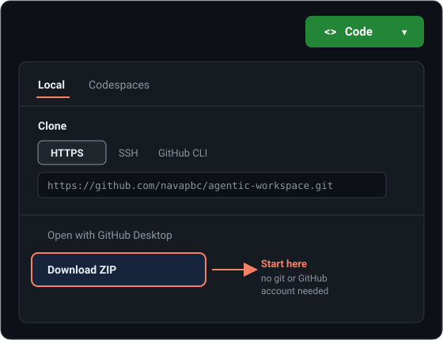

# Agentic Workspace Starter Kit

[](https://github.com/navapbc/agentic-workspace/actions/workflows/ci.yml)
[](LICENSE)


A starter kit for anyone standing up a **shared, agentic product workspace**: a place where a team (and the agents they work with) share the same context, boundaries, vocabulary, and reusable procedures for the products they own together.

This kit generalizes an operating model proven on a mature internal deployment so any product team can adopt it without rebuilding the architecture from scratch. It is **harness-agnostic** (works with Codex/ChatGPT, Claude Code, OpenCode, Cursor, and future tools) and **model-agnostic** (nothing here depends on a specific model).

**You do not build the machinery — you install it.** The kit ships a complete, runnable support engine (skills, a shared-facts catalog, tools, and a validation gate) that installs verbatim into your workspace. Two files are yours to write: your vocabulary and your source ladder. Everything else upgrades in place when the kit does.

## Quickstart

### No terminal? Start here

You do not need git or the command line to use this kit. Let your agent do the setup.

1. On the [repo page](https://github.com/navapbc/agentic-workspace), click the green **Code** button, then **Download ZIP** at the bottom of the menu, and unzip it. No git or GitHub account needed.

   

2. Open the unzipped folder in your agent tool (Codex/ChatGPT, Claude Code, Claude Desktop, Cursor, and so on).
3. Paste this to your agent:

```text
Set up a new shared agentic workspace for me using this starter kit.
Run scripts/new-workspace.sh --name "<my-product>-workspace" --with-support into a
sibling folder, then interview me to fill in the root AGENTS.md with our boundaries
and vocabulary, plus the two files I own: agentic-support/CONCEPTS.md and
agentic-support/docs/context-source-ladder.md. Keep AGENTS.md thin. Then run the
workspace-setup skill to declare my roots and get the workspace doctor green.
```

The agent creates the folders and files, interviews you for the parts only you know, and walks you through the rest. You never open a terminal. (This assumes an agent that can read and write local files, such as the Codex CLI, Claude Code, Claude Desktop, or Cursor. On a web-only agent, for example Codex in ChatGPT, use the synced-storage path in [docs/collaboration-and-governance.md](docs/collaboration-and-governance.md) instead.)

### Prefer the terminal?

```bash
git clone https://github.com/navapbc/agentic-workspace.git
cd agentic-workspace
./scripts/new-workspace.sh --name "my-product-workspace" --with-support
```

Already have a workspace and want the engine (or a newer one)?

```bash
./scripts/install-support.sh /path/to/my-workspace --check   # see what would change
./scripts/install-support.sh /path/to/my-workspace
```

Either way, open your new workspace in your agent tool and ask it to read the root `AGENTS.md`, then run `agentic-support/tools/workspace-doctor.sh`. See [START-HERE.md](START-HERE.md) for the full flow.

### Want to see it working first?

[`reference/sandbox/`](reference/sandbox/) is a complete, fictional workspace with the engine installed, a product area, a real skill, six Context Fabric records, a generated repo digest, and a typed routing exception. Open it and try the five-minute tour in its README before building your own.

**For agents:** the entry instructions live in [`AGENTS.md`](AGENTS.md) (Claude Code reads [`CLAUDE.md`](CLAUDE.md), which imports it). A machine-readable index is in [`llms.txt`](llms.txt).

---

## Who this is for

This is for anyone leading shared work with agents — product and delivery leads, ops, researchers, engineers — who:

- works on one or more products alongside teammates, and
- wants your agent (Codex, Claude Code, etc.) to reliably know the product context, boundaries, and vocabulary without re-explaining it every session, and
- wants that shared context to be usable by teammates on their own machines and their own tools.

You do **not** need to be an engineer. You do not need to know the Context Fabric schema or write shell scripts. The kit is phased so you can start with a single markdown file and grow only as far as your team needs.

---

## Start here

1. Read **[START-HERE.md](START-HERE.md)** — what an agentic operating model is, and how to use this kit.
2. Pick your phase in **[docs/phased-adoption.md](docs/phased-adoption.md)** — Crawl, Walk, or Run. Most teams should start at Crawl.
3. Do the one-time setup in **[docs/local-setup.md](docs/local-setup.md)** — install the small set of dependencies and point your harness at the workspace.
4. Scaffold your workspace: ask your agent to set it up (see the no-terminal Quickstart above), run `scripts/new-workspace.sh` (see [START-HERE.md](START-HERE.md)), or copy `templates/workspace/` by hand.

If you only read one thing, read [START-HERE.md](START-HERE.md).

**Visual overview:** a one-page anatomy of the kit is in [reference/anatomy.md](reference/anatomy.md), which renders directly on GitHub (Mermaid diagrams + tables). A richer standalone version is in [reference/anatomy.html](reference/anatomy.html) for opening locally or publishing as a hosted page. Both are good for socializing the kit with teammates and stakeholders.

---

## What's in the kit

| Path | What it is |
|---|---|
| `START-HERE.md` | Entry point. The operating model in plain language and how to adopt it. |
| `AGENTS.md` / `CLAUDE.md` | Agent guidance for working **inside this kit** (using it vs. improving it). |
| `docs/architecture.md` | The clear architecture overview: layers, the authority chain, and how context flows. |
| `docs/phased-adoption.md` | Crawl / Walk / Run adoption path, mapped to Nava's AI-strategy phases. |
| `docs/local-setup.md` | Harness-agnostic and model-agnostic local setup, dependencies, and per-tool config. |
| `docs/harness-and-model-agnostic.md` | Why and how the kit stays portable across tools and models. |
| `docs/collaboration-and-governance.md` | The two lanes, optional review/ownership practices, and explicit git and Google Drive setup. |
| `docs/context-fabric.md` | What the Context Fabric is, when a team needs it, and how to author records. |
| `docs/directory-and-naming-standard.md` | The kebab-case directory-naming standard the kit and its workspaces follow. |
| `docs/glossary.md` | Shared vocabulary for the kit itself. |
| `templates/workspace/` | Copy-to-create scaffold for a new shared workspace (thin `AGENTS.md`, Docs lanes). |
| `templates/support/` | The complete support engine: skills, Context Fabric, tools, validation, and doctrine. Installs verbatim; you author two files. |
| `templates/harness-config/` | Example config for Codex, Claude Code, and OpenCode. |
| `scripts/new-workspace.sh` | Scaffolds a new shared workspace from the templates. |
| `scripts/install-support.sh` | Installs or upgrades the support engine in an existing workspace (`--check` first). |
| `scripts/validate-workspace.sh` | Lightweight Crawl-phase check (POSIX sh, no dependencies): thin guidance, no secrets, no checkouts, valid JSON. Once the engine is installed, its own `validation/check-workspace.sh` is the authority and checks far more. |
| `scripts/seed-sandbox.sh` | (Re)generates the fictional sandbox workspace below. |
| `reference/sandbox/` | A fully populated, fictional workspace you can open and trial. Doubles as a regression test. |
| `reference/anatomy.md` | Shareable visual one-pager that renders on GitHub (Mermaid + tables). |
| `reference/anatomy.html` | Richer standalone one-pager for local viewing or hosting. |
| `reference/reference-implementation.md` | How a mature internal deployment maps to this model, as a worked reference. |
| `reference/example-walkthrough.md` | A fictional team standing up a workspace end to end. |

---

## The one-paragraph version

A shared agentic workspace has three layers. A thin **guidance layer** (`AGENTS.md` files, one per directory) tells any agent the boundaries and where to route work. A **support layer** (skills + a shared-context catalog) holds the reusable procedures and machine-readable facts about your products, authored once and mirrored into whatever tool each teammate uses. A **product-work layer** holds the actual product artifacts, split into a product-work lane (the work the team relies on) and a prototyping lane (experiments). Everything is plain markdown, JSON, and shell, so it stays portable across tools, models, and machines. It grows in phases, so a newcomer can start with a single file.

---

*Kit version 0.1.0. Maintained by Nava PBC. Generalized from a mature internal operating model. See `reference/reference-implementation.md` for the source patterns.*
