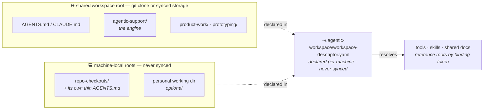
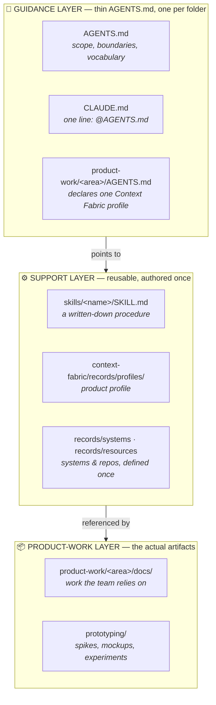
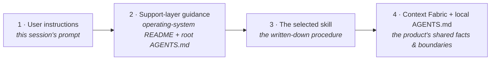

# Agentic Workspace Starter Kit — Anatomy

> Shared context your whole team's agents can read.

A kit for product managers to stand up a shared workspace where the context, boundaries, vocabulary, and reusable procedures for your products are written down once — in a form every agent tool and every teammate can use.

`Harness-agnostic` (Codex, Claude Code, OpenCode, Cursor) · `Model-agnostic` · `Multi-root` · `Phased — start in ~30 minutes`

> This page renders on GitHub. A richer standalone version for local viewing or hosting is in [anatomy.html](anatomy.html). Everything below uses the kit's fictional [sandbox](sandbox/), generated by [`scripts/seed-sandbox.sh`](../scripts/seed-sandbox.sh) — every product, system, repo, and person is invented.

---

## The topology: several roots, one engine

Before the layers: a member's workspace is **several physical directories handed to the harness at once**, not one folder. The shared tree carries the engine and the work; machine-local roots carry code checkouts and personal working folders that must never sync.



Three rules, each earned the hard way: roots are **physical, not symlinked** (harness viewers do not show symlinked contents, and the failure is silent); machine-local paths are **declared, not derived** (a guess is right on the author's machine and quietly wrong elsewhere); and the session's **primary folder is machine-local** (or the harness writes your personal settings into the shared tree, repeatedly).

`agentic-support/tools/workspace-doctor.sh` reports which roots a session has and which capability tiers follow.

---

## Three layers, wired together

An agent working in any folder, on any tool, resolves what's true, what's allowed, and how the team does things — without a human re-explaining it.



| Layer | What it holds | Rule |
|---|---|---|
| **Guidance** | Thin `AGENTS.md` (+ `CLAUDE.md` `@import`), one per folder | Boundaries and routing only. Nearest file wins. |
| **Support** | Skills, a machine-readable shared-context catalog, tools, and a validation gate | Installed whole from the kit; authored once, mirrored into every tool. |
| **Product work** | The real artifacts, split into product-work and prototyping | Split by intent; review/ownership is the team's choice. |

---

## The authority chain — how an agent decides

A fixed resolution order. Later, more-specific sources refine earlier ones; they never contradict them silently.



---

## One line wires it together

A product folder declares its profile in a single line; that line resolves to the shared facts an agent needs — which systems and repos the product touches, at what priority, and who (if anyone) owns it.

**File tree (`reference/sandbox/`):**

```
sandbox/
├─ AGENTS.md   CLAUDE.md
├─ product-work/
│  └─ benefits-notices/
│     ├─ AGENTS.md
│     └─ docs/{plans,solutions}/
├─ agentic-support/
│  ├─ skills/notice-change-brief/
│  └─ context-fabric/records/
│     ├─ profiles/benefits-notices.json
│     ├─ systems/ (2)
│     └─ resources/ (2)
└─ prototyping/
```

**The wiring:**

```jsonc
// product-work/benefits-notices/AGENTS.md
Context Fabric profile: product:benefits-notices
Steward: Priya Anand

// …/records/profiles/benefits-notices.json
{
  "id": "product:benefits-notices",
  "repositories": [
    { "resourceId": "repository:…/bn-notice-service",
      "selectionTier": "primary",   "coverage": "direct" },
    { "resourceId": "repository:…/eligibility-events",
      "selectionTier": "supporting", "coverage": "reference" }
  ]
}
```

---

## What a session actually looks like

The same authority chain, resolving on a real request in the sandbox. The PM asks; the agent reads the boundaries, resolves the product's shared facts, follows the skill, and stays inside the guardrails — with nothing re-explained.

> _Reconstructed for illustration — not a captured session._

**PM:** Draft a change brief for BN-072 — legal wants the renewal-deadline sentence simplified.

| Chain step | What resolves |
|---|---|
| 🧭 guidance | read `AGENTS.md` → "notices reflect upstream rules, they don't set them"; BN-### IDs are stable |
| ⚙️ context | resolved `product:benefits-notices` → BN-072 lives in `bn-notice-service` (primary/direct); `eligibility-events` is supporting/reference |
| ⚙️ skill | selected `notice-change-brief` |

**Agent:** Brief drafted and saved to `product-work/benefits-notices/docs/plans/bn-072-deadline-language.md`.
- **Change:** simplify the renewal-deadline sentence on BN-072. The deadline date itself is unchanged.
- **Upstream dependency:** the deadline value comes from an `eligibility-events` field — kept the wording change decoupled from that contract.
- **Guardrail respected:** wording only. Determination logic lives upstream and is untouched.
- **Rollback:** revert the BN-072 entry in the template set.

One request touches every step of the authority chain — and the PM never restated the product's context.

---

## Adopt in stages

Start at Crawl. Move up only when you feel the specific pain the next phase removes. Each phase is independently useful; the arc maps onto Nava's AI-strategy horizons.

| Phase | Effort | You have |
|---|---|---|
| **Crawl** | ~30 min | One workspace, one thin `AGENTS.md`, a few docs lanes, zero dependencies |
| **Walk** | ~half a day | The engine installed (`install-support.sh`), your two authored files, roots declared, doctor green, first skill and profile |
| **Run** | ongoing | Repo digests, sync manifests, routing card, accreting learnings, gate in CI |

See [docs/phased-adoption.md](../docs/phased-adoption.md).

---

## The gate keeps it honest

The same fictional sandbox is checked on every change. Two levels: the kit's dependency-free Crawl-phase checker (below), and — once the engine is installed — `agentic-support/validation/check-workspace.sh`, which additionally enforces manifest↔skill consistency, the skill contract, no user-home paths, no sibling-relative cross-root references, thin `AGENTS.md`, record field rules, `shellcheck`, and the descriptor and doctor test suites.

```console
$ ./scripts/validate-workspace.sh reference/sandbox
ok    root AGENTS.md present
ok    no token-shaped secrets
ok    no op:// references
ok    no node_modules
ok    no OS metadata or .env files
ok    no nested code checkouts
ok    no absolute machine paths
ok    all JSON parses

RESULT: PASS
```

---

**Start here:** read [START-HERE.md](../START-HERE.md), then run `scripts/new-workspace.sh --name "<your-workspace>" --with-support`, or open [reference/sandbox/](sandbox/) to trial a populated one first. Everything in the kit is plain markdown, JSON, and shell — portable across tools, models, and machines.
